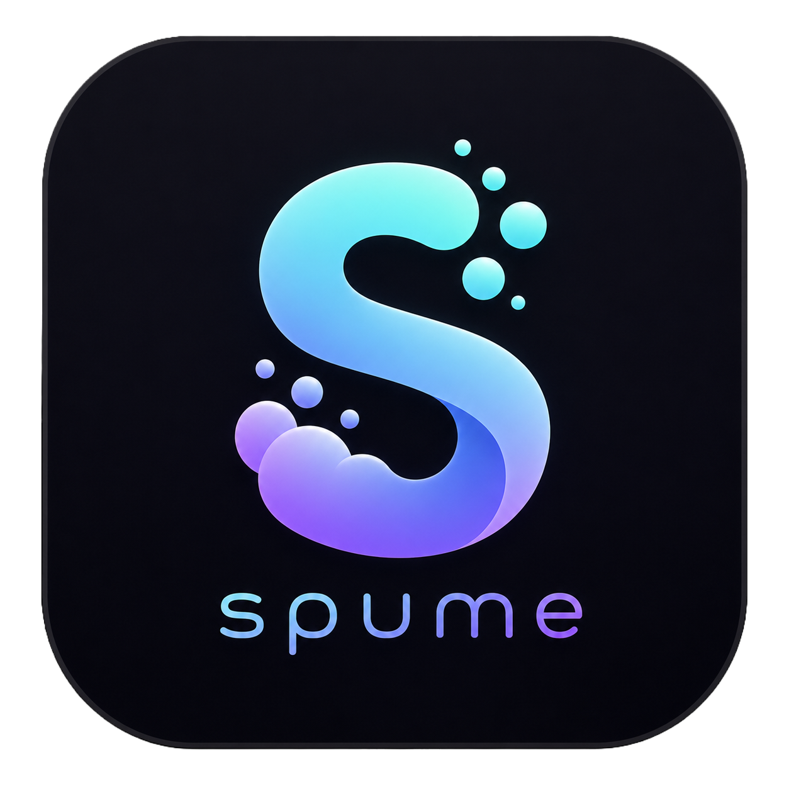

<div align="center">
    
    <p>
        <strong>Lightweight, ergonomic Solana JSON-RPC client for wasm.</strong>
    </p>
    <p>
        <a href="https://github.com/aursen-labs/spume/actions"></a>
        <a href="https://docs.rs/spume"></a>
        <a href="https://opensource.org/licenses/Apache-2.0"></a>
    </p>
</div>

## Install

```bash
cargo add spume                       # HTTP RPC only
cargo add spume --features pubsub     # + WebSocket subscriptions
```

The `pubsub` feature is off by default — opt in only if you need WebSocket subscriptions. HTTP-only consumers ship a smaller wasm bundle.

## HTTP usage

```rust
use spume::WasmClient;

let client = WasmClient::new("https://api.mainnet-beta.solana.com");

let slot    = client.get_slot(None).await?;
let version = client.get_version().await?;
let latest  = client.get_latest_blockhash(None).await?;
```

Address-taking methods (e.g. `get_balance`, `get_account_info`) take `&Address`:

```rust
use solana_address::address;

let owner = address!("11111111111111111111111111111111");
let balance = client.get_balance(&owner, None).await?.value;
```

See [`src/methods.rs`](src/methods.rs) for the full list of RPC methods.

### Response size limit

HTTP responses are capped at **10 MiB by default** so a misconfigured or
malicious RPC can't OOM the wasm runtime with a multi-gigabyte body. Tune the
limit with `.with_max_response_size(bytes)`:

```rust
// 50 MiB for `getProgramAccounts` on a busy program:
let client = WasmClient::new("https://rpc.example.com")
    .with_max_response_size(50 * 1024 * 1024);
```

Oversized responses are rejected with `RpcError::RpcRequestError("response body too large …")` — pre-flight via `Content-Length`, or post-read for chunked encoding.

## WebSocket / PubSub usage

> Requires the `pubsub` feature.

```rust
use {futures::StreamExt, spume::WasmPubsubClient};

let client = WasmPubsubClient::connect("wss://api.mainnet-beta.solana.com")?;

// Stream of typed notifications:
let mut sub = client.slot_subscribe().await?;
while let Some(info) = sub.next().await {
    let info = info?;          // SlotInfo { slot, parent, root }
    // …
}

// Explicit unsubscribe awaits the server's ack; dropping the subscription
// fires a best-effort unsubscribe instead.
sub.unsubscribe().await?;
```

Supported subscriptions: `account`, `block`, `logs`, `program`, `root`, `signature`, `slot`, `slotsUpdates`, `vote`. See [`src/pubsub_methods.rs`](src/pubsub_methods.rs).

## Example

[`examples/leptos-slot-monitor`](examples/leptos-slot-monitor) is a small [Leptos](https://leptos.dev) CSR app that streams the live devnet slot via WebSocket and fetches the node version via HTTP:

```bash
cd examples/leptos-slot-monitor
cargo install trunk
trunk serve --open
```

## Development

```bash
just fmt      # nightly rustfmt
just clippy   # clippy on the native target
just test     # spawn surfpool, run wasm integration tests, tear down
```

The `test` recipe expects [`surfpool`](https://surfpool.run), `wasm-bindgen-cli@0.2.121`, [`just`](https://github.com/casey/just), and Node 22+ in `PATH`. The repo's [`rust-toolchain.toml`](rust-toolchain.toml) auto-installs the stable toolchain with the `wasm32-unknown-unknown` target.

CI runs `fmt`, `clippy` (on both `--all-features` and `--no-default-features`), and the wasm test suite on every push; see [`.github/workflows/ci.yml`](.github/workflows/ci.yml).
